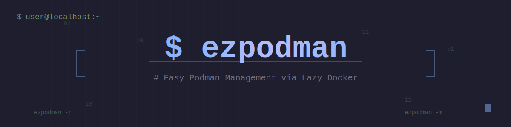

<div align="center">
  
</div>

**`ezpodman`** is a Bash wrapper that makes it easy to launch [Lazydocker](https://github.com/jesseduffield/lazydocker) against **local** or **remote rootless Podman** instances using SSH-based tunnels.

- ✔️ Fancy interactive menu (Local / Remote / Tunnel-only / Setup / Manage)
- ✔️ **New:** Built-in wizard to setup remote connections (generates SSH keys, copies IDs)
- ✔️ Auto-configures SSH tunnels to `podman-remote` sockets
- ✔️ One-tunnel-per-remote with `--open`, `--persist`, `--stop`, `--restart`
- ✔️ Fully Docker-compatible (sets `DOCKER_HOST` + `DOCKER_API_VERSION`)
- ✔️ Self-contained: no installers or daemons required

> 📦 GitHub repo: <https://github.com/alfonsosanchez12/ezpodman>

## 🔄 Project Rename

> **Note:** This project was previously named `lazypodman`. It has been renamed to `ezpodman` to avoid confusion with other GitHub projects and to make it easier to remember and type. All functionality remains the same.

If you forked or bookmarked the old repository, GitHub automatically redirects old URLs to the new name, but we recommend updating your references.

---

## ⚙️ Prerequisites

Install the following on your **local system**:

| Tool             | Purpose                      | Install command                                   |
|------------------|-------------------------------|----------------------------------------------------|
| `bash`           | Script runner                | Included in all Unix systems                      |
| `docker`         | Optional: for other tooling  | `sudo apt install docker.io` or via Docker site   |
| `podman`         | Local container engine       | `sudo apt install podman` or `brew install podman`|
| `podman-remote`  | Connect to remote Podman     | Included with Podman 4+                           |
| `lazydocker`     | Docker/Podman TUI            | Install                                           |
| `ssh`            | Tunnel creation              | Included on Linux/macOS                           |
| `jq`             | Parses `podman-remote` JSON  | `sudo apt install jq` or `brew install jq`        |

Optional:

| Tool      | Purpose                     |
|-----------|-----------------------------|
| `fzf`     | Fuzzy remote picker         |

---

## 🔐 Remote Podman Setup (one-time)

To manage **remote rootless Podman** instances, you can use the built-in wizard or set it up manually.

### 🪄 Automatic Setup (Recommended)

Run `ezpodman --setup` (or choose Option 4 in the menu).
The script will guide you through:

1. Naming the connection.
2. Specifying the destination (`user@host`).
3. **Generating an SSH key** (ed25519) if you don't have one.
4. **Copying the SSH key** to the remote host (`ssh-copy-id`).
5. Adding the connection to `podman-remote`.

### 📝 Manual Setup

If you prefer to do it yourself:

### 1. Generate an SSH key

If you don't already have one:

```bash
ssh-keygen -t ed25519 -f ~/.ssh/id_ed25519
ssh-copy-id user@remote-host
```

### 2. On the remote machine (as the same user)

**Enable Podman’s rootless socket and lingering:**

```bash
loginctl enable-linger $USER
systemctl --user enable --now podman.socket
```

**Verify it's listening:**

`curl --unix-socket $XDG_RUNTIME_DIR/podman/podman.sock http://d/v3.0.0/libpod/_ping`

### 3. Back on your local machine: create a podman-remote connection

```bash
podman-remote system connection add my-remote \
  --identity ~/.ssh/id_ed25519 \
  ssh://user@remote-host/run/user/1000/podman/podman.sock
```

**Test it:**

`podman-remote --connection my-remote info`

## 📥 Installation

### Option 1: Install to `/usr/local/bin` (Recommended)

```bash
sudo curl -fsSL https://raw.githubusercontent.com/alfonsosanchez12/ezpodman/main/ezpodman -o /usr/local/bin/ezpodman
sudo chmod +x /usr/local/bin/ezpodman
```

This location is in `$PATH` by default on both Linux and macOS.

---

## 🔄 Upgrade

To upgrade to the latest version, simply re-run the installation command:

**If installed to `/usr/local/bin`:**
```bash
sudo curl -fsSL https://raw.githubusercontent.com/alfonsosanchez12/ezpodman/main/ezpodman -o /usr/local/bin/ezpodman
sudo chmod +x /usr/local/bin/ezpodman
```

To check your current version:
```bash
ezpodman --version
```

---

## 🗑️ Uninstall

### Remove the script

**If installed to `/usr/local/bin`:**
```bash
sudo rm /usr/local/bin/ezpodman
```

### Clean up connections and tunnels (optional)

```bash
# Kill all active tunnels
ezpodman --kill-tunnels  # (run before removing the script)

# Remove all podman-remote connections created by ezpodman
podman-remote system connection list
podman-remote system connection remove <connection-name>
```

### Remove SSH keys (optional)

If you want to remove SSH keys created during setup:

```bash
rm ~/.ssh/id_ed25519
rm ~/.ssh/id_ed25519.pub
```

**Note:** Only remove SSH keys if they were created specifically for ezpodman and aren't used elsewhere!

## 🧪 Usage

Interactive menu (recommended)
`ezpodman`

Option 1: Local (rootless) Podman on this host

Option 2: Remote Podman via podman-remote connection (run Lazydocker)

Option 3: Remote Podman: OPEN TUNNEL ONLY (no Lazydocker)

Option 4: Setup new podman-remote connection (Wizard)

Option 5: Manage Connections/Tunnels (List, Stop, Remove)

Option 6: Exit

### CLI usage

```bash
ezpodman                            # Run interactive Menu
ezpodman --setup                    # Setup a new connection (Wizard)
ezpodman --remove my-remote         # Remove a connection configuration
ezpodman --local                    # Run against local Podman
ezpodman --remote my-remote         # Open tunnel and run Lazydocker
ezpodman --remote my-remote --persist  # Keep SSH tunnel alive after Lazydocker exits

ezpodman --open my-remote           # Just open the tunnel and print env exports
ezpodman --list-tunnels             # Show tunnels: age, PID, remote uptime
ezpodman --stop my-remote           # Close a specific tunnel
ezpodman --restart my-remote        # Restart and show DOCKER_HOST
ezpodman --kill-tunnels             # Kill all tunnels created by ezpodman
```

## 🧼 Maintenance

**List all tunnels**
`ezpodman --list-tunnels`

**Stop one**
`ezpodman --stop my-remote`

**Kill all**
`ezpodman --kill-tunnels`

**Remove a connection**
`ezpodman --remove my-remote` (or use Option 5 in the menu)

## 🛠️ To-Do

 ✅ Add --restart and --list-tunnels with PID/uptime ✔️

 ⏳ One-line installer (curl | sh)

 ⏳ Homebrew tap / AUR

 ⏳ Config file for defaults (API version, autossh, etc.)

## 📁 Project Structure

```bash
.
├── ezpodman                   # Main Bash script
├── README.md                  # You're here
└── LICENSE                    # MIT
```

## 🧑‍💻 Author

Developed by Alfonso Sanchez

Contributions welcome!
